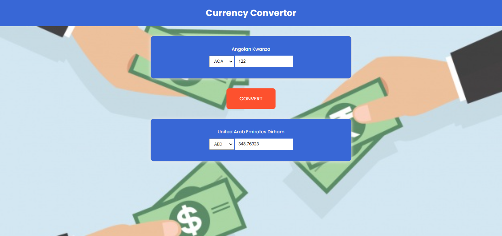

This project was bootstrapped with [Create React App](https://github.com/facebook/create-react-app).

## How to use

This app uses the Free Curency Convertor API for currency conversion, clone the repo and run npm install to install all the 
dependencies.
### `yarn start`

Runs the app in the development mode. 
Open [http://localhost:3000](http://localhost:3000) to view it in the browser.

The page will reload if you make edits. 
You will also see any lint errors in the console.

### `Demo Link `

 [Click here](https://angry-leavitt-7a2673.netlify.app) to launch the demo.

 Use vpn if the application does not fire up. :smiley:

